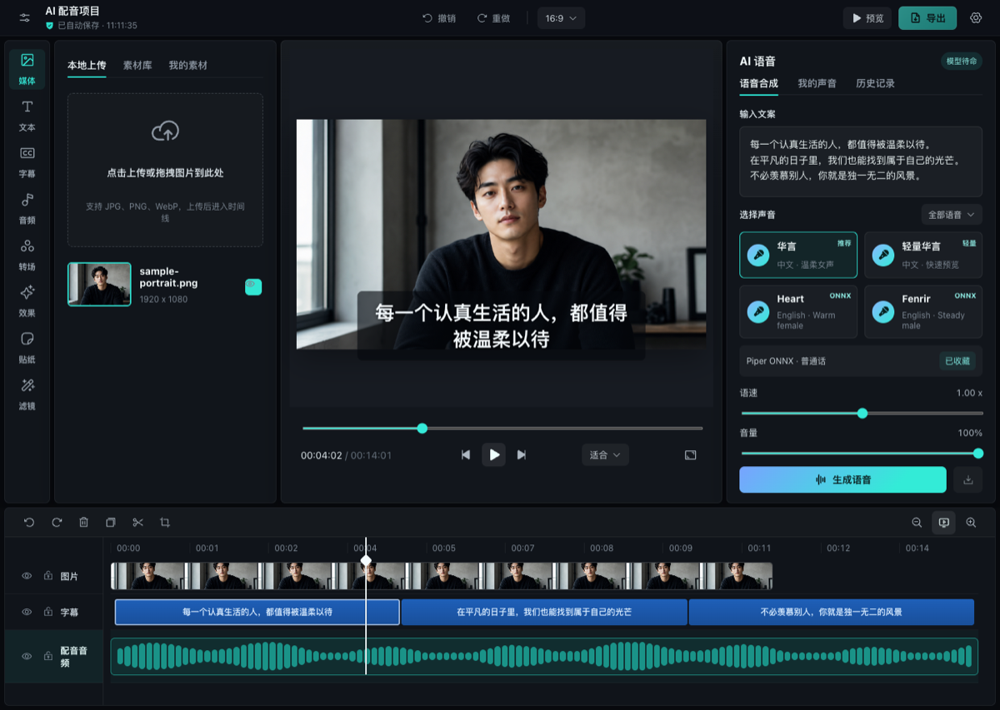

# Timeline Studio — ИИ-видеоредактор в браузере

[English](README.md) | [中文](README.zh-CN.md) | [日本語](README.ja.md) | [한국어](README.ko.md) | [Español](README.es.md) | [Français](README.fr.md) | [Deutsch](README.de.md) | [Português](README.pt-BR.md) | [ไทย](README.th.md) | [Tiếng Việt](README.vi.md) | **Русский**

[](https://skills.sh/MartinDelophy/ai-video-editor)

Timeline Studio — локальный ИИ-видеоредактор, работающий в браузере. Он объединяет многодорожечную временную шкалу в стиле CapCut, ИИ-озвучивание, автоматические субтитры, инструменты компьютерного зрения, говорящие аватары и детерминированный офлайн-экспорт.

[Открыть редактор](https://video-editor.ai-creator.top/) · [Посмотреть демо](https://www.youtube.com/watch?v=chdRPG2ndMs) · [Hugging Face Space](https://huggingface.co/spaces/haixin/timeline-studio)



## Основные возможности

- Многоязычная озвучка с Piper/VITS ONNX и Kokoro 82M.
- Автоматические субтитры на базе Whisper small q8 ONNX.
- Умное кадрирование с YOLOS tiny и MODNet.
- Разделение вокала и музыки, аватары JoyVASA и LivePortrait.
- Многодорожечный монтаж с наложениями, масками, фильтрами, анимацией и ключевыми кадрами.
- Экспорт MP4/WebM в браузере с WebCodecs и сведением звука.
- Устанавливаемое PWA, локальный кэш моделей и проекты `.timeline`.

## Agent Skill

Репозиторий содержит Agent Skill [`edit-timeline-studio`](skills/edit-timeline-studio/SKILL.md) для планирования, выполнения и проверки редактируемых видеотаймлайнов. Для установки требуется GitHub CLI 2.90.0 или новее.

Для установки через [skills.sh](https://skills.sh/MartinDelophy/ai-video-editor) требуется Node.js 22.20.0 или новее.

```bash
npx skills add MartinDelophy/ai-video-editor --skill edit-timeline-studio
```

```bash
# Claude Code
gh skill install MartinDelophy/ai-video-editor edit-timeline-studio --agent claude-code --scope user

# Codex
gh skill install MartinDelophy/ai-video-editor edit-timeline-studio --agent codex --scope user
```

Добавьте `--pin v0.6.1`, чтобы установить проверенный релиз, а не автоматически следовать за последним. Перед установкой Skill можно просмотреть командой `gh skill preview MartinDelophy/ai-video-editor edit-timeline-studio`.

## Дорожная карта

- **Сейчас:** повысить надёжность детерминированного офлайн-экспорта и временной шкалы, расширить сквозные браузерные тесты.
- **Далее:** выпустить версионируемый headless-обработчик команд для монтажа с агентами и упростить обмен шаблонами проектов.
- **Позже:** добавить совместное рецензирование, интерфейс расширений и больше локально проверенных ИИ-моделей.

Приоритеты обсуждаются в [GitHub Discussions](https://github.com/MartinDelophy/ai-video-editor/discussions).

## Нужна помощь

Приветствуются вклады в браузерные медиа, WebCodecs, WebGPU/ONNX, UX временной шкалы, локализацию, тесты и документацию. Сообщайте о воспроизводимых ошибках в [Issues](https://github.com/MartinDelophy/ai-video-editor/issues), делитесь идеями в [Discussions](https://github.com/MartinDelophy/ai-video-editor/discussions) или присылайте небольшие исправления, тесты, переводы и примеры.

## Быстрый старт

Требуются Node.js 20+ и современный браузер Chromium. Рекомендуется WebGPU.

```bash
git clone https://github.com/MartinDelophy/ai-video-editor.git
cd ai-video-editor
npm install
npm run dev
```

## Проверка

```bash
npm test
npm run build
npm run check
```

## Поддержка и обратная связь

Если этот проект оказался вам полезен, поставьте ему ⭐ Star. Если вы столкнулись с проблемой, [создайте Issue](https://github.com/MartinDelophy/ai-video-editor/issues).

Присоединяйтесь к нашему [сообществу в Discord](https://discord.gg/uq2uvUTBr), чтобы задавать вопросы, делиться отзывами и общаться с другими пользователями и участниками проекта.

## Лицензия

[MIT](LICENSE)
